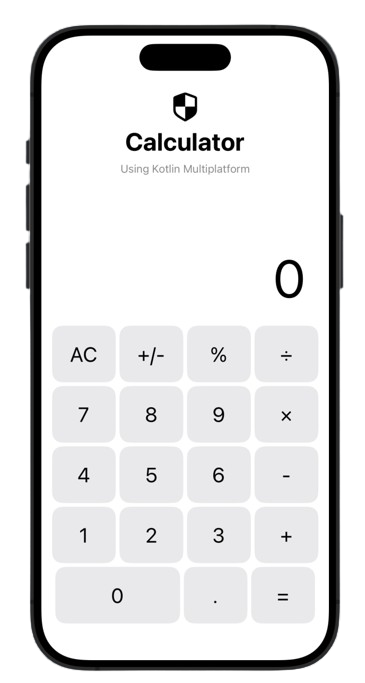
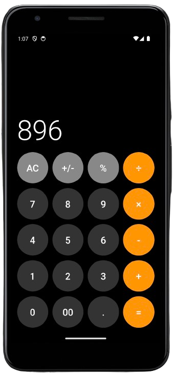

# Calculator (Using Kotlin Multiplatform)

[](https://confluence.jetbrains.com/display/ALL/JetBrains+on+GitHub)

This is a **Kotlin Multiplatform (KMP) Project**. It includes iOS and Android applications with a native UI and a module with code shared across both platforms.

## Features

This sample demonstrates the following KMP features:
* **Using platform-specific APIs with the expect/actual mechanism** (see `Platform.kt`)
* **Shared business logic and calculations** (see `Calculator.kt`)
* **Native UIs for Android and iOS** with shared code integration
* **Unit tests for Shared Module** (see `CalculatorTest.kt`, `iosTest.kt`, `androidTest.kt`)

## Screenshots

<p align="left">
  
    &nbsp;&nbsp;&nbsp;&nbsp;&nbsp;&nbsp;     
  
</p>
<p align="left">
  &nbsp;&nbsp;&nbsp;&nbsp;&nbsp;&nbsp;&nbsp;&nbsp;&nbsp;&nbsp;&nbsp;&nbsp;
  <sub>iOS (SwiftUI)</sub>
  &nbsp;&nbsp;&nbsp;&nbsp;&nbsp;&nbsp;&nbsp;&nbsp;&nbsp;&nbsp;&nbsp;&nbsp;&nbsp;&nbsp;&nbsp;&nbsp;&nbsp;&nbsp;&nbsp;&nbsp;&nbsp;&nbsp;&nbsp;&nbsp;&nbsp;&nbsp;&nbsp;&nbsp;&nbsp;&nbsp;&nbsp;&nbsp;&nbsp;&nbsp;&nbsp;&nbsp;
  <sub>Android (Compose)</sub>
</p>

## Advantages of Kotlin Multiplatform

- **Code Sharing**: Write shared code once and use it across multiple platforms, reducing code duplication and ensuring consistency.
- **Platform-Specific Implementations**: Use the `expect` and `actual` keywords to handle platform-specific code seamlessly.
- **Leverage Platform Capabilities**: Utilize the full power of Kotlin while accessing native APIs and UI frameworks.

## How to Use

### Prerequisites

- **Android Studio with the KMP Plugin**: Install the [KMP plugin for Android Studio](https://plugins.jetbrains.com/plugin/14936-kotlin-multiplatform-mobile).
- **Xcode**: Required for running and debugging the iOS application.

### Setup Instructions

1. **Clone the Repository**
   ```bash
   git clone https://github.com/tirupati17/calculator-kotlin-multiplatform.git
   cd your-repo
   ```

2. **Open the Project in Android Studio**
   - Open Android Studio and select `Open an existing Android Studio project`.
   - Navigate to the cloned repository and open it.

3. **Run and Debug on Android**
   - Select the Android app configuration from the **Run configuration** menu.
   - Click on the Run button or use the `Shift + F10` shortcut to run the app on an Android emulator or device.

4. **Run and Debug on iOS**
   - Open the iOS project in Xcode by navigating to `iosApp/iosApp.xcworkspace`.
   - Select your target device or simulator.
   - Click on the Run button or use the `Cmd + R` shortcut to run the app.

5. **Running Tests**
   - Shared module tests can be run from Android Studio by pressing the gutter icon on a test class or method.
   - iOS tests can be run from Xcode in the usual way.

### How It Works

#### Shared Code

The shared module contains common business logic and functionality that can be reused across both Android and iOS. This is where you define the logic for calculations, network requests, and other business rules.

Example:
```kotlin
// Calculator.kt
package com.jetbrains.kmm.shared

class Calculator {
    companion object {
        fun sum(a: Int, b: Int): Int = a + b
        fun minus(a: Int, b: Int): Int = a - b
        fun multiply(a: Int, b: Int): Int = a * b
        fun divide(a: Int, b: Int): Int {
            if (b == 0) throw IllegalArgumentException("Divider can't be zero")
            return a / b
        }
    }
}
```

#### Platform-Specific Code

The `expect` and `actual` keywords are used to handle platform-specific implementations. For instance, `Platform.kt`:

```kotlin
// Platform.kt
expect fun getPlatformName(): String

// PlatformAndroid.kt
actual fun getPlatformName(): String = "Android"

// PlatformIOS.kt
actual fun getPlatformName(): String = "iOS"
```

#### UI Implementation

UI code is implemented separately for Android and iOS, ensuring a native user experience. Shared code is integrated into the native UI codebase:

- **Android**: Using Jetpack Compose
- **iOS**: Using SwiftUI

### Example Integration

In Android, the shared code is accessed as follows:
```kotlin
// MainActivity.kt
val result = Calculator.sum(3, 4)
```

In iOS, the shared code is accessed similarly:
```swift
// ContentView.swift
let result = Calculator.Companion().sum(a: 3, b: 4)
```

## Related Links

- Visit [Kotlin Multiplatform Developer Portal](https://kotlinlang.org/lp/mobile/) to learn more about the technology.
- Check out the [Networking and Data Storage with KMP Hands-On](https://play.kotlinlang.org/hands-on/Networking%20and%20Data%20Storage%20with%20Kotlin%20Multiplatfrom%20Mobile/) lab to learn how to create a mobile application for Android and iOS with a shared codebase using Ktor and SQLDelight.

This project is part of the [Kotlin Multiplatform Mobile GitHub repository](https://github.com/Kotlin/kmm-basic-sample).

The UI for this project has been inspired by the iOS calculator for the Android version, using Jetpack Compose, and self-designed for iOS, kind of inspired by the Android Google calculator, using SwiftUI.

